# Screenshot-Galerie

Die Bilder zeigen Version 0.18.1 mit automatisch erzeugten, isolierten Demo-Daten. Der Aufnahmeprozess greift weder auf echte Logger-Profile noch auf Funkgerät, Netzwerk, API-Tokens oder persönliche ADI-Dateien zu.

## QSO loggen

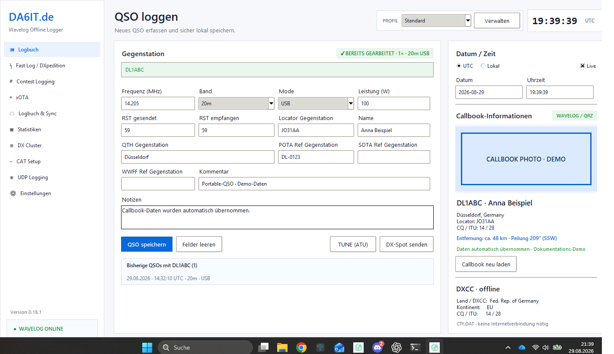

## Fast Log / DXpedition

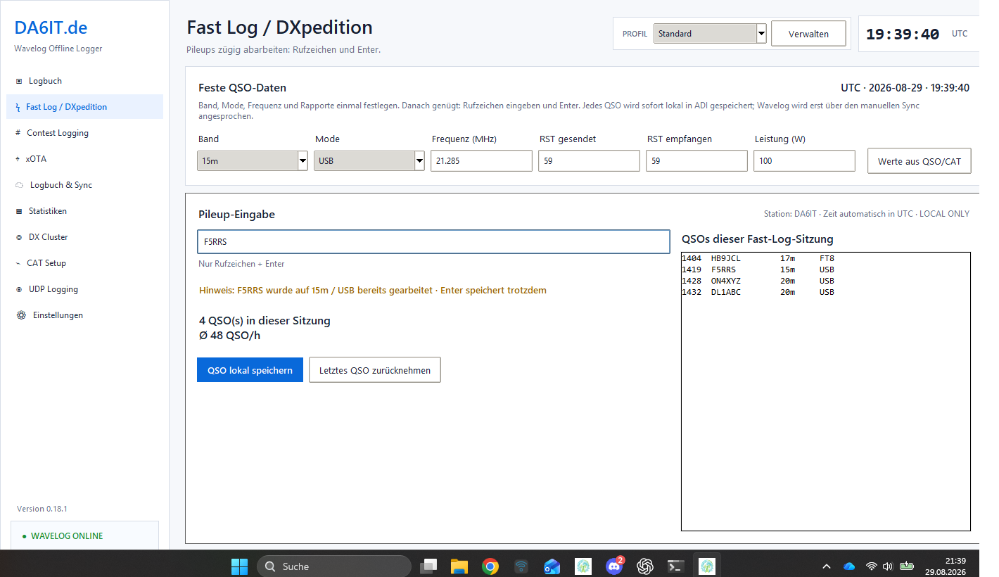

## Contest Logging

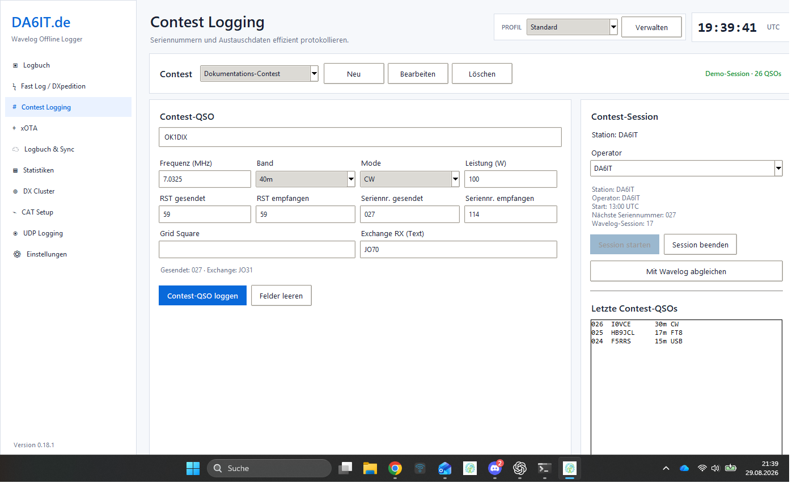

## xOTA

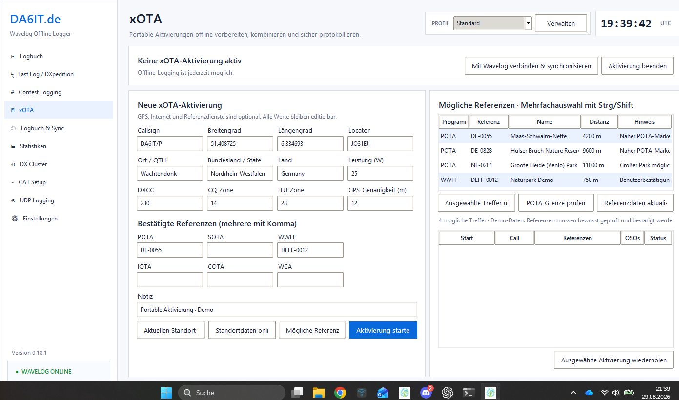

## Logbuch und Sync

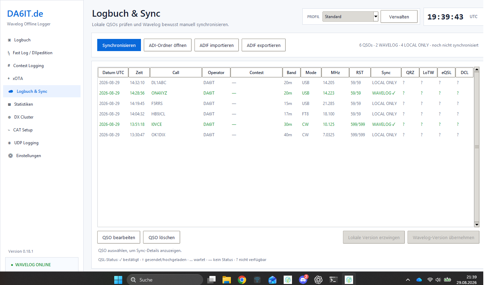

## Statistiken

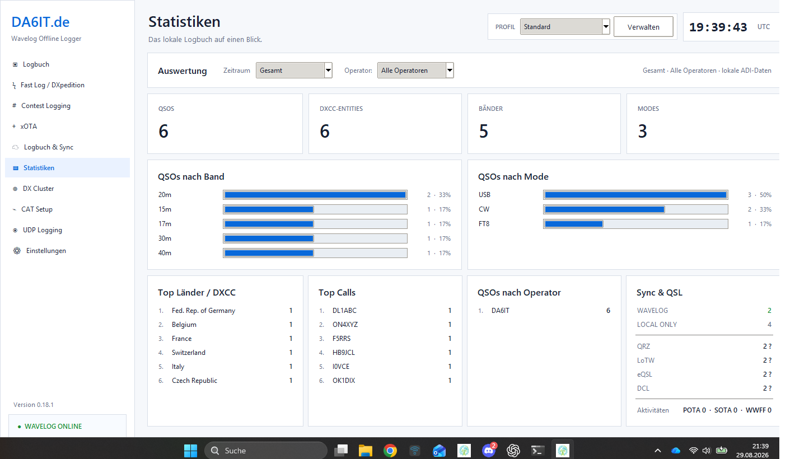

## CAT Setup

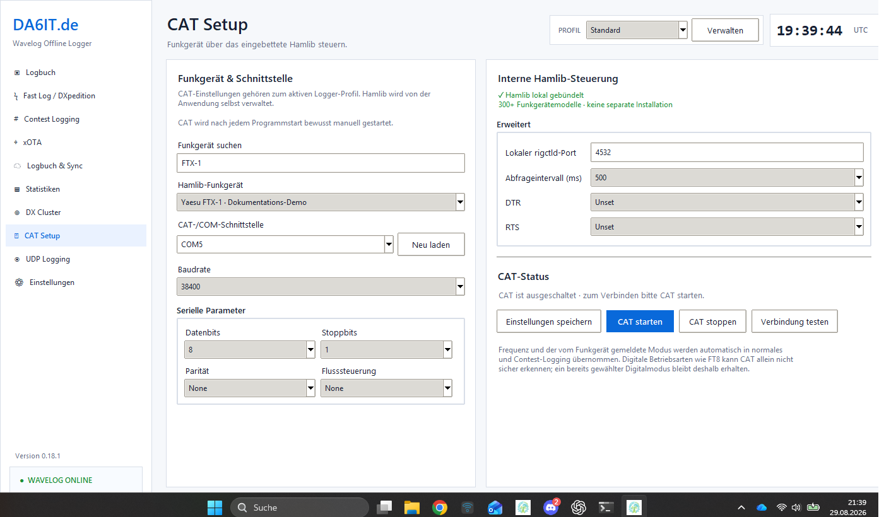

## DX Cluster

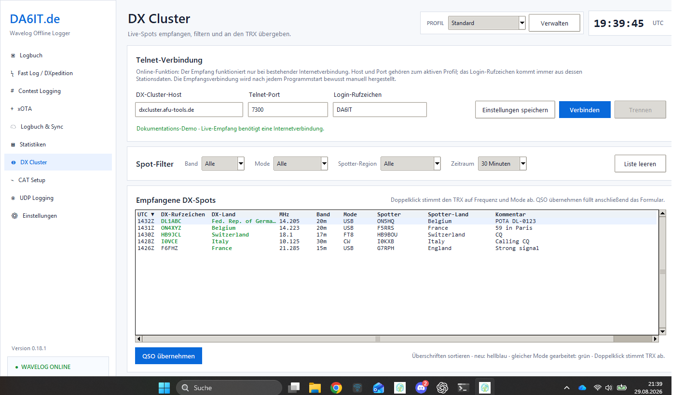

## UDP Logging

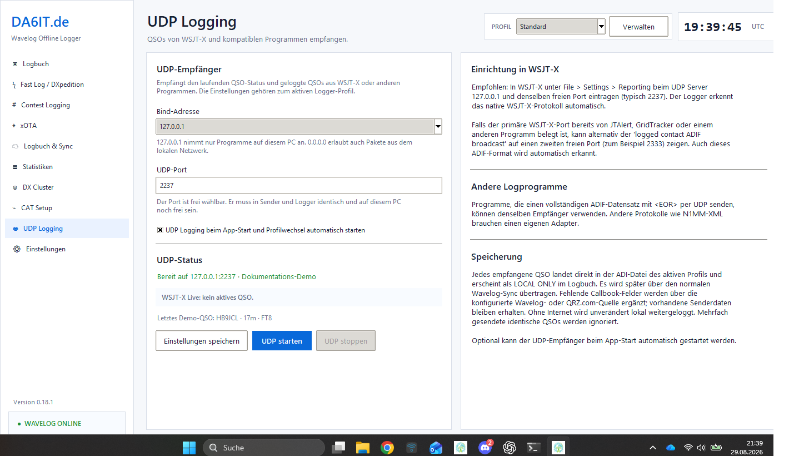

## Einstellungen – Allgemein

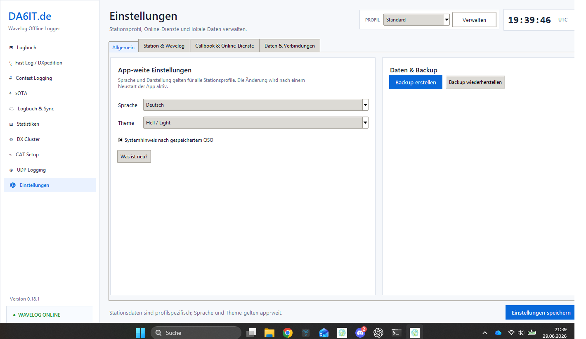

## Englisch und Dark-Theme

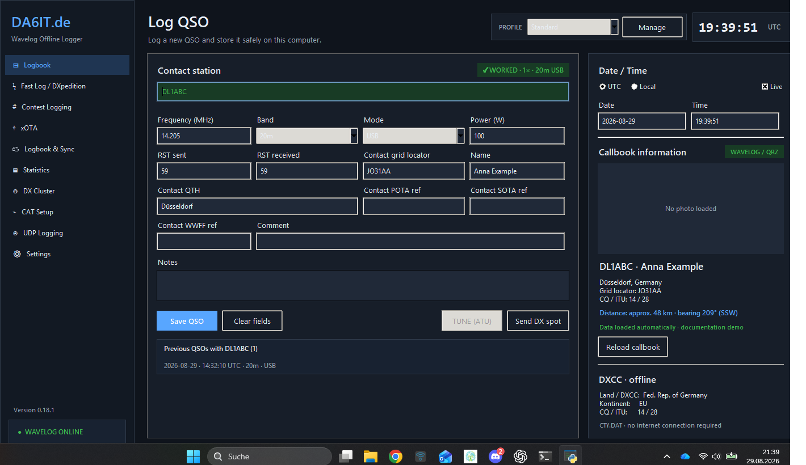

## Einstellungen – Station & Wavelog

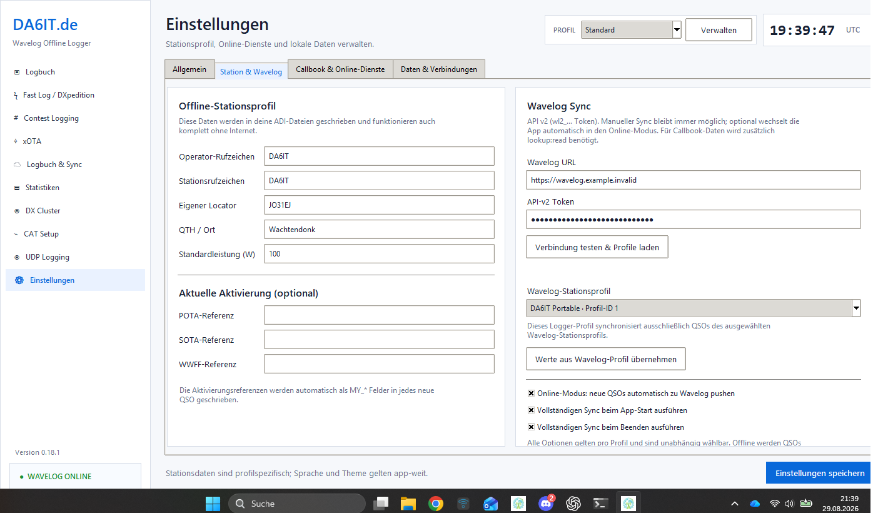

## Einstellungen – Callbook & Online-Dienste

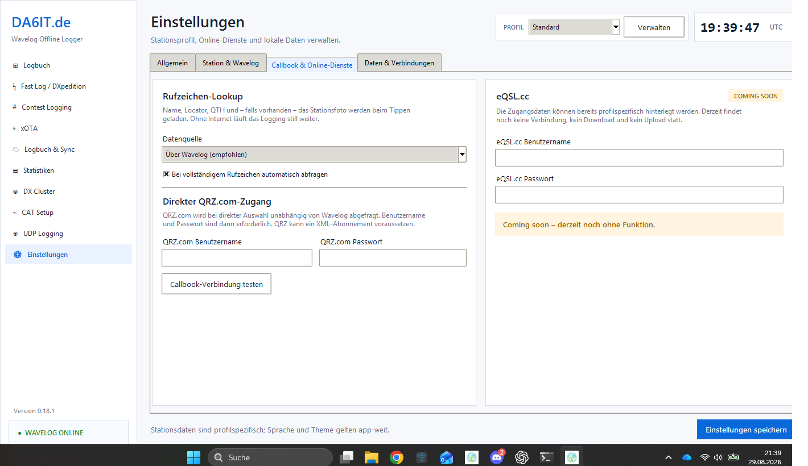

## Einstellungen – Daten & Verbindungen

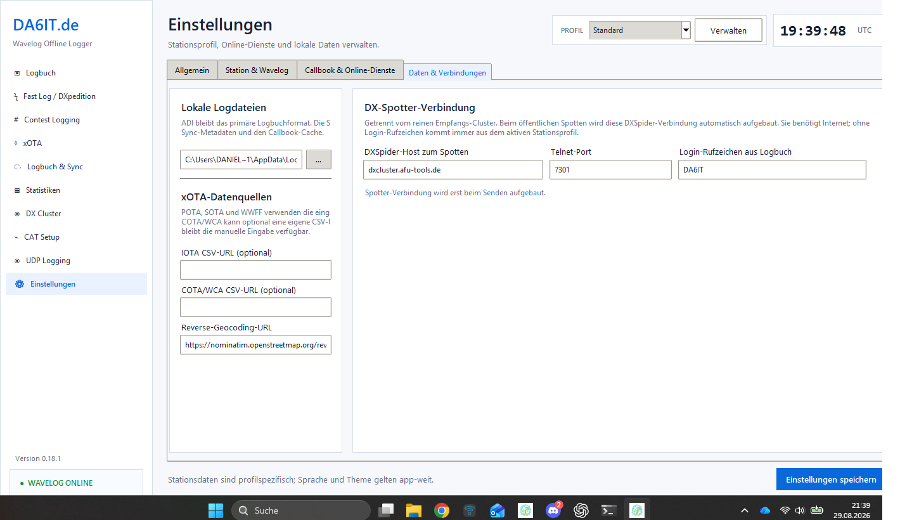

## Automatischer Sync läuft

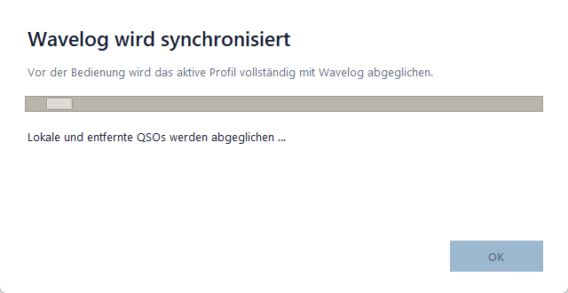

## Automatischer Sync abgeschlossen

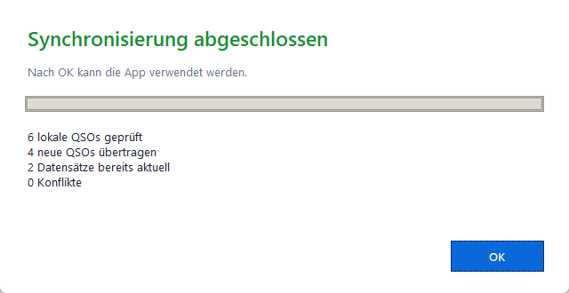

## Screenshots aktualisieren

Unter Windows aus einer interaktiven PowerShell im Projektordner:

```powershell
.\scripts\capture-doc-screenshots.ps1
```

Das Skript erzeugt alle Pflichtbilder neu, validiert den vollständigen Satz und löscht sein temporäres Demo-Profil anschließend wieder.
