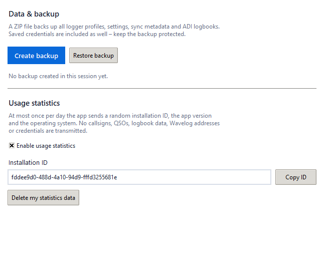
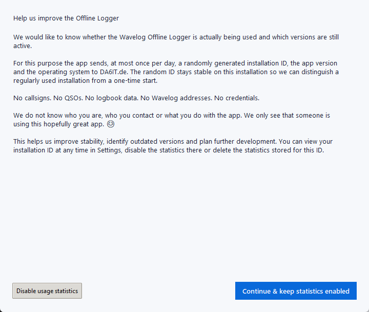
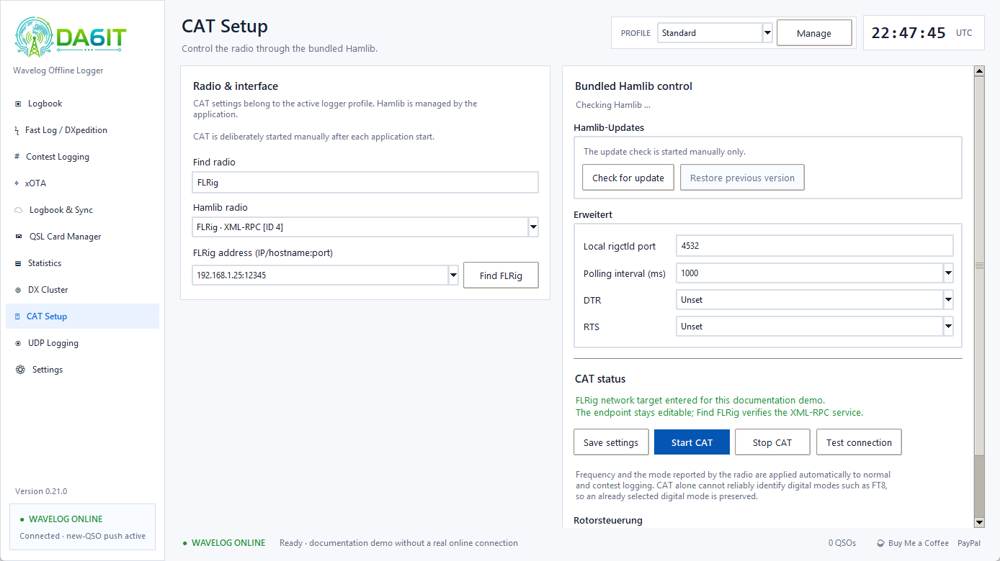
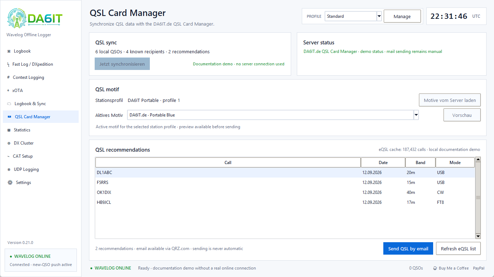
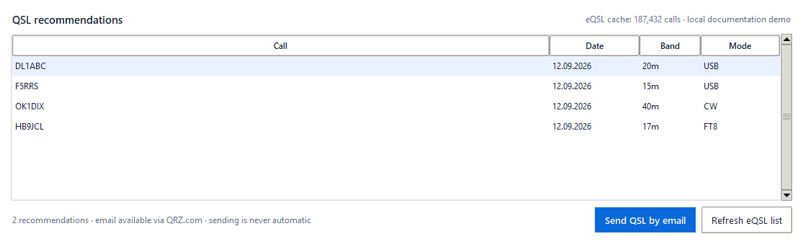

# User guide — DA6IT.de Wavelog Offline Logger 0.21.0

[Deutsch](../USER_GUIDE.md) · **English**

This guide covers the complete application. Its screenshots are generated with isolated demo data and contain no private logs, tokens or credentials.

## 1. Language, theme and profiles

Open **Settings → General** to select **English** or **German**, Light or Dark theme, and QSO desktop notifications. The same page contains the pseudonymous usage-statistics control, the visible random installation ID and the deletion action for statistics stored for that ID.

On first start of v0.21.0, a dedicated notice is shown before any usage-statistics heartbeat is allowed. Closing the notice without choosing an option does not trigger a statistics transmission.

Save and restart the application after changing language or theme. These are app-wide preferences; station, Wavelog, CAT, cluster and UDP values remain profile-specific.

Use the profile selector in the header to switch operating contexts. The app stops the old UDP listener before switching and starts the new profile's listener when its autostart option is enabled. A profile can be created, renamed, duplicated or deleted locally. Local profile deletion never deletes Wavelog data.

## 2. Normal QSO logging

Enter callsign, frequency, band, mode, reports and any optional locator, name, QTH, xOTA references, comment and notes. **Save QSO** writes the contact to ADI immediately. The form is cleared after successful manual or external logging. The most recently saved QSO remains available as a separate DX-spot candidate.

The callsign field indicates worked status and shows recent matching contacts. If own and remote grid locators are known, the sidebar displays approximate distance and bearing. Wavelog or QRZ.com lookup can fill name, locator, QTH and photo; logging continues normally when lookup or internet is unavailable. **Open QRZ.com** opens the currently entered callsign in the default browser.

## 3. Fast Log / DXpedition

Set fixed band, mode, frequency, reports and power once. Enter a callsign and press Enter for each contact. Every QSO is stored locally at once. The session counter and rate are local. Only the most recent QSO can be undone, and only while it is still exclusively local.

## 4. Contest logging

Create or select a contest preset, choose operator and start the session. Presets contain the ADIF contest name, time range, starting serial, exchange fields and defaults. Numeric Wavelog session IDs are assigned automatically during synchronization and are not entered as the ADIF contest name. **Sync with Wavelog** exchanges sessions and QSO assignments bidirectionally. Contest QSOs use the same ADI logbook and safety rules as normal QSOs.

## 5. xOTA

xOTA combines POTA, SOTA, WWFF, IOTA and COTA/WCA references. GPS and Maidenhead conversion work without requiring Wavelog. Online services can complete place data and candidate references. Select multiple candidates with Ctrl/Shift, verify them and explicitly accept them.

POTA candidates use a locally cached official catalogue. Nearby markers up to 10 km and additional large-park candidates up to 25 km are shown. Catalogue coordinates are not proof that the station is inside the park; **Check POTA boundary** opens the selected reference on pota-map.info for manual verification.

## 6. Logbook and synchronization

Important states are `LOCAL ONLY`, `WAVELOG ✓`, changed, conflict and sync error. Select a row to see the stored reason. A conflict is resolved only by explicitly choosing the local or Wavelog version. Missing external ADI data is never interpreted as an automatic remote-deletion request.

Online mode pushes only new, never-linked QSOs. A full manual/startup/shutdown sync handles downloads, edits, deletions, confirmation status and conflicts. Automatic full sync displays a blocking progress window and a final summary before the app becomes usable or closes.

The QRZ, LoTW, eQSL, ClubLog and DCL columns show status supplied by Wavelog when available. Since v0.19.0, confirmation requests are restricted to station locations belonging to the active logger profile. ClubLog upload state is also read from Wavelog ADIF, while received confirmations preferably come from the confirmation API.

ADIF import validates records, creates a ZIP backup, skips duplicates and verifies the merged log. Export writes the current profile log. Since 0.17.0 each profile uses one continuous ADI file; older daily files are backed up and safely merged.

## 7. Statistics

Statistics are calculated only from the local ADI log. Filter by period and operator to inspect QSO count, entities, bands, modes, countries, callsigns, synchronization and confirmation status.

## 8. CAT / Rotor / Hamlib

Select the radio model, interface or network target, serial parameters and polling interval. Save, then start CAT or test the connection. CAT deliberately starts manually after every app launch. Frequency and safe mode information feed normal, Fast and contest logging. TUNE/ATU asks for confirmation, turns red while active and never enables PTT by itself.

### Rotor control

The **Rotor control** area in CAT Setup uses Hamlib `rotctld` independently from radio CAT. Choose the Hamlib rotor model, interface/COM port, baud rate, local `rotctld` port and polling interval. The app-managed daemon listens on `127.0.0.1` only.

**Hamlib Dummy [ID 1]** provides hardware-free testing and simulates movement so live position, target, compass and STOP can be verified.

When both station grids are known, the QSO form uses the calculated bearing as the target. **Turn rotor** starts movement only after an explicit click; **STOP** halts it. Callsign lookup and bearing calculation never move hardware automatically. On Az/El rotors the last known elevation is preserved.

Profile changes, Hamlib replacement and application shutdown stop the app-managed rotor runtime.

### Updating Hamlib

On Windows, **Check for update** in CAT Setup performs an on-demand check. The app accepts stable Hamlib releases only, downloads the official Windows x64 archive from the Hamlib GitHub release, verifies GitHub's published SHA-256 digest and runs `rigctld --version` before activating it. Any active CAT and rotor connections are stopped first.

The previous runtime is retained. Use **Restore previous version** to swap back if a radio works less reliably with the update. Profiles, CAT settings and QSOs are never changed by this operation.

On Linux and macOS, Hamlib remains part of the platform-specific application package because it must be built and, where applicable, signed for that platform and architecture. It is therefore updated with the regular app package.

### FLRig over the network

Select **FLRig** as the radio. The serial interface field changes to **FLRig address (IP/hostname:port)**. The default is `127.0.0.1:12345` when FLRig runs on the same computer.

- The endpoint always remains directly editable.
- **Find FLRig** checks the local computer first, followed by a bounded search of private local IPv4 networks on the FLRig default port and any port already entered manually.
- A candidate is accepted only when the FLRig XML-RPC service answers; an open TCP port alone is not enough.
- Save the CAT settings after selecting a result, or test the connection directly.

Discovery runs only when **Find FLRig** is clicked. Manual configuration remains available when nothing is found. Enter the endpoint directly when a firewall, another subnet, IPv6 or a custom network setup prevents discovery. FLRig must expose its XML-RPC service on the intended network interface.

## 9. DX Cluster

Connect manually to receive live spots. Filter by band, mode, time and spotter region; sort by headings. Worked markers compare band and mode. Double-click tunes the radio without changing page; **Use for QSO** fills the log form and **Open QRZ.com** opens the selected spot callsign in the browser. Public spotting uses a separate profile-specific DXSpider connection.

## 10. UDP / WSJT-X

The receiver supports native WSJT-X status/logged-QSO packets and complete ADIF records ending in `<EOR>`. The primary WSJT-X UDP server is required for live callsign, locator, frequency, mode and report preview. The secondary ADIF broadcast carries completed contacts only. Configure the same free address/port on both sides; normally use `127.0.0.1`.

External QSOs are saved locally first, deduplicated and optionally enriched from the selected callbook source. Existing received values are never overwritten. Autostart is profile-specific and applies at app startup and profile changes.

### WSJT-X file synchronization

The dedicated **WSJT-X Sync** settings tab links the active Logger profile to one WSJT-X log file. It supports the normal `%LOCALAPPDATA%\WSJT-X\wsjtx_log.adi`, `--rig-name` profiles below `%LOCALAPPDATA%\WSJT-X - <rig-name>\wsjtx_log.adi`, and a manually selected path.

Startup, shutdown and manual synchronization can be enabled independently per Logger profile. **Sync now** runs the file merge immediately.

The Offline Logger remains the local merge hub. Missing QSOs are added between the Offline Logger and WSJT-X; with Wavelog configured, the normal full synchronization can combine this into a controlled three-way workflow. A missing record is never treated as an automatic deletion request.

Before `wsjtx_log.adi` is changed, the logger creates a timestamped backup. Duplicate matching uses callsign, band, mode and a small time tolerance. A clearly foreign `STATION_CALLSIGN` is not imported into the active Logger profile. When the WSJT-X record has no station callsign, the active Logger identity and available station defaults can be filled in.

File synchronization and **UDP Logging** are complementary: UDP provides live status and `QSO Logged` events while WSJT-X is running, while file synchronization reconciles the persistent WSJT-X log.
## 11. Settings and online services

**Station & Wavelog** stores operator/station identity, local defaults, API URL/token and selected Wavelog station profile. **Callbook & Online services** chooses Wavelog or direct QRZ.com and automatic lookup. QRZ direct lookup works independently from Wavelog but may require a QRZ XML subscription. Personal eQSL credentials remain placeholders for a future direct upload/sync feature; independently, the QSL Card Manager downloads the eQSL member list without those credentials for local recommendations. **Data & connections** contains local log path, xOTA source URLs, DX spotting and UDP options.

## 12. Backup and restore

**Settings → General → Data & backup** creates a ZIP containing all profiles, app preferences, metadata and ADI logs, including external log directories. Treat it like a credential because stored tokens may be included. Restore validates format, paths and limits, creates a safety backup first, restores into safe profile directories and then closes the app for a clean restart.

## 13. Updates and What's new

The app checks GitHub Releases silently. After confirmation it downloads only the matching HTTPS package and validates its SHA-256 checksum. On Windows the bootstrapper records the exact path and filename of the EXE actually launched. After clean shutdown a helper replaces precisely that file and restarts it at the same location under the same custom name; the download and rollback copy are kept in the protected update directory. macOS/Linux packages are downloaded for normal system installation. A one-time **What's new?** page appears on first start of each release and remains available under Settings.

## 14. Privacy and troubleshooting

Core logging, profiles, ADI, statistics and CTY.DAT work offline. Network can be used by configured Wavelog, QRZ, the DA6IT.de QSL Card Manager, the locally evaluated eQSL member-list download, xOTA, DX Cluster/spotting, release checks, initial Windows runtime setup and the pseudonymous usage statistics enabled after the first-start notice. The usage heartbeat contains only the random installation ID, application version and operating-system family; it can be disabled and deleted from Settings. See [Troubleshooting](TROUBLESHOOTING.md), [Privacy](../../PRIVACY.md) and [Security](../../SECURITY.md).

## DA6IT.de QSL Card Manager

Store the Connection Key under **Settings → QSL**. In **QSL Card Manager**, synchronize QSOs, load motifs and select one per station profile. **Preview** renders the card locally.

In **Logbook & Sync**, **Send QSL Email** sends one selected QSO directly. Multiple QSOs selected with Ctrl/Shift are handed to the DA6IT.de server-side mail queue.

The **Email QSL** column shows `✅` when the server records the mail as sent. This does not confirm delivery or reading.

### QSL recommendations

The QSL Card Manager downloads the eQSL member list locally and shows email-QSL recommendations only for QSOs with a usable email recipient. An eQSL entry with a log upload within the last six months is treated as active and is not recommended. Missing entries or older activity can make a QSO eligible. Already sent and queued/pending QSL emails are hidden from the recommendation list.

Recommendations never send mail automatically. **Send QSL by email** starts the existing DA6IT.de delivery path with the server-side QRZ recipient check.

### Private control copy

Under **Settings → QSL Card Manager**, **Send a control copy to me** can optionally be enabled with an email address. The server adds the same QSL card privately by BCC; the other station cannot see the control-copy address.

The already verified QSL account email can be used immediately. A different address requires approval through a message sent to the QSL account email before the new control-copy address becomes active.

### Automatic QSL synchronization

After the one-time setup, the logger uses the local QSL cache immediately and synchronizes new QSOs, QSL status and motifs automatically in the background. Changing profiles also refreshes the matching motif/layout. Offline logging remains independent of this.

Under **Settings → QSL**, an optional private **control copy** can be enabled and sent to a verified personal email address. The remote station never sees this control address.

Automatic background synchronization never sends QSL mail on its own. Sending still requires an explicit user action.

### QSL Card Manager – workflow

After the QSL connection key has been configured once, the QSL integration works automatically during normal operation. Existing local QSL data and motifs are used immediately from the cache, followed by background updates of new QSO mappings, status and motifs.

A newly logged QSO is automatically added to the QSL system and receives its `qsoUid`. If a QSL is sent immediately and the mapping is still missing, the Logger synchronizes exactly that QSO automatically before sending.

Changing the active profile automatically refreshes the matching QSL motif and personal field positions. Manual QSL synchronization remains available as a force refresh.

An optional private control copy can be enabled under **Settings → QSL**. The configured verified personal email address is not visible to the remote station.

Automatic background synchronization never sends QSL email. Every QSL email still requires an explicit user action.
