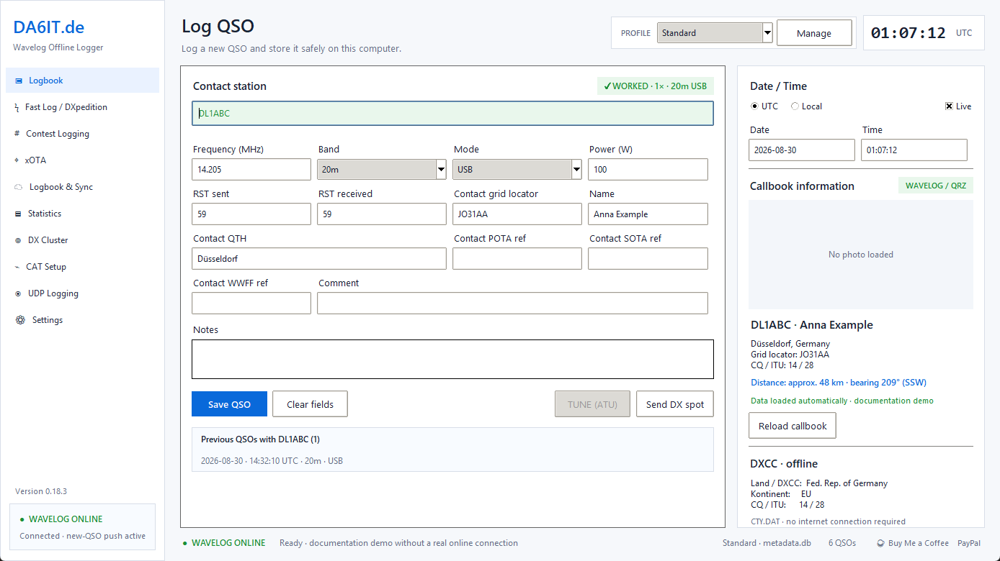
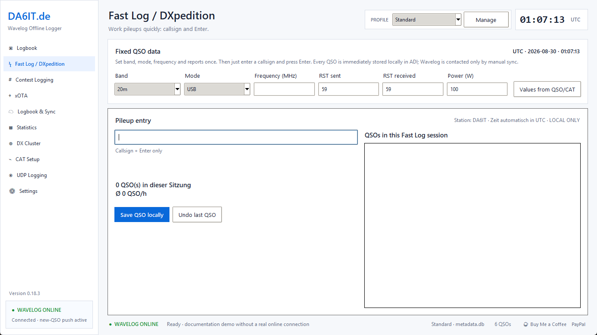
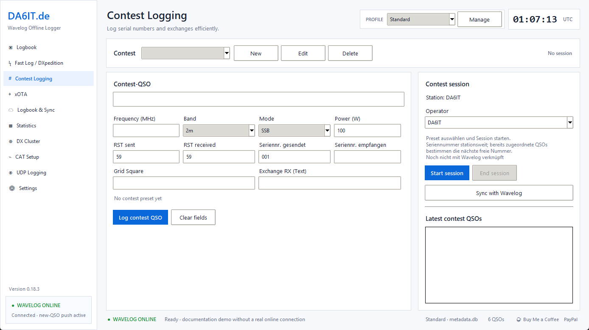
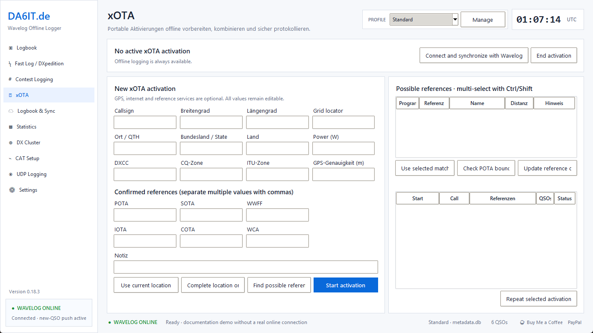
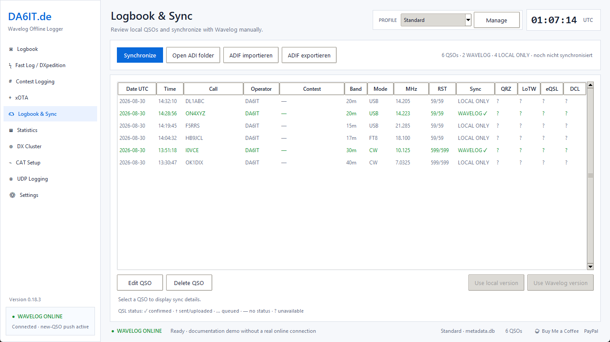
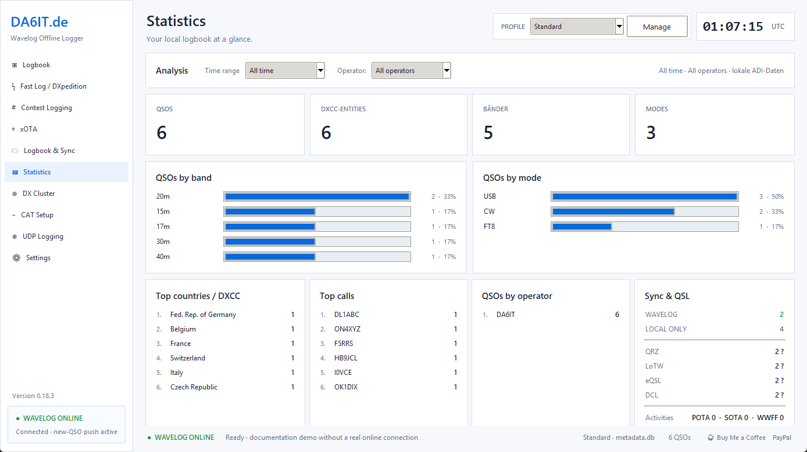
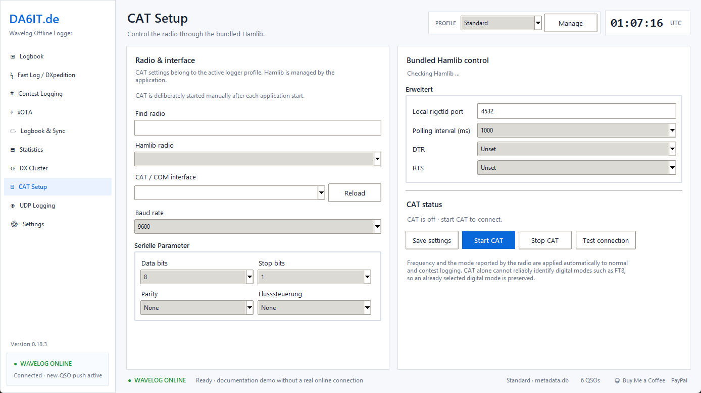
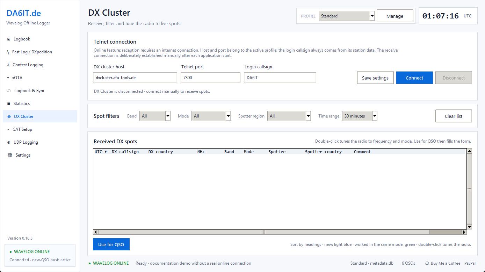
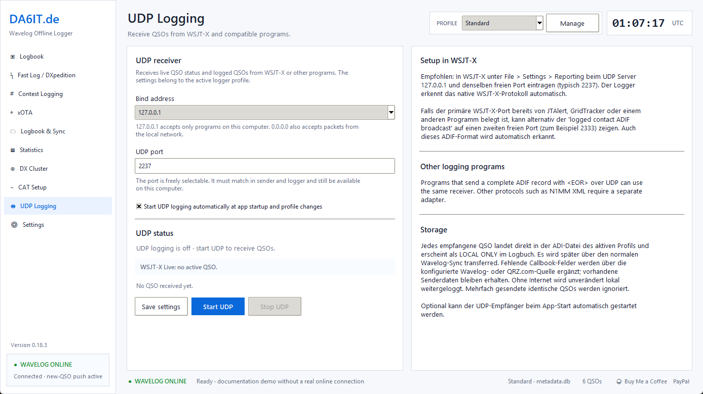

# User guide — DA6IT.de Wavelog Offline Logger 0.18.3

[Deutsch](../USER_GUIDE.md) · **English**

This guide covers the complete application. Its screenshots are generated with isolated demo data strictly inside the taskbar-free Windows work area and contain no private logs, tokens or credentials.

## 1. Language, theme and profiles

Open **Settings → General** to select **English** or **German**, Light or Dark theme, and QSO desktop notifications. Save and restart the application after changing language or theme. These are app-wide preferences; station, Wavelog, CAT, cluster and UDP values remain profile-specific.

Use the profile selector in the header to switch operating contexts. The app stops the old UDP listener before switching and starts the new profile's listener when its autostart option is enabled. A profile can be created, renamed, duplicated or deleted locally. Local profile deletion never deletes Wavelog data.

## 2. Normal QSO logging

Enter callsign, frequency, band, mode, reports and any optional locator, name, QTH, xOTA references, comment and notes. **Save QSO** writes the contact to ADI immediately. The form is cleared after successful manual or external logging. The most recently saved QSO remains available as a separate DX-spot candidate.

The callsign field indicates worked status and shows recent matching contacts. If own and remote grid locators are known, the sidebar displays approximate distance and bearing. Wavelog or QRZ.com lookup can fill name, locator, QTH and photo; logging continues normally when lookup or internet is unavailable.

## 3. Fast Log / DXpedition

Set fixed band, mode, frequency, reports and power once. Enter a callsign and press Enter for each contact. Every QSO is stored locally at once. The session counter and rate are local. Only the most recent QSO can be undone, and only while it is still exclusively local.

## 4. Contest logging

Create or select a contest preset, choose operator and start the session. Presets contain the ADIF contest name, time range, starting serial, exchange fields and defaults. Numeric Wavelog session IDs are assigned automatically during synchronization and are not entered as the ADIF contest name. **Sync with Wavelog** exchanges sessions and QSO assignments bidirectionally. Contest QSOs use the same ADI logbook and safety rules as normal QSOs.

## 5. xOTA

xOTA combines POTA, SOTA, WWFF, IOTA and COTA/WCA references. GPS and Maidenhead conversion work without requiring Wavelog. Online services can complete place data and candidate references. Select multiple candidates with Ctrl/Shift, verify them and explicitly accept them.

POTA candidates use a locally cached official catalogue. Nearby markers up to 10 km and additional large-park candidates up to 25 km are shown. Catalogue coordinates are not proof that the station is inside the park; **Check POTA boundary** opens the selected reference on pota-map.info for manual verification.

## 6. Logbook and synchronization

Important states are `LOCAL ONLY`, `WAVELOG ✓`, changed, conflict and sync error. Select a row to see the stored reason. A conflict is resolved only by explicitly choosing the local or Wavelog version. Missing external ADI data is never interpreted as an automatic remote-deletion request.

Online mode pushes only new, never-linked QSOs. A full manual/startup/shutdown sync handles downloads, edits, deletions, confirmation status and conflicts. Automatic full sync displays a blocking progress window and a final summary before the app becomes usable or closes.

ADIF import validates records, creates a ZIP backup, skips duplicates and verifies the merged log. Export writes the current profile log. Since 0.17.0 each profile uses one continuous ADI file; older daily files are backed up and safely merged.

## 7. Statistics

Statistics are calculated only from the local ADI log. Filter by period and operator to inspect QSO count, entities, bands, modes, countries, callsigns, synchronization and confirmation status.

## 8. CAT / Hamlib

Select the radio model, interface or network target, serial parameters and polling interval. Save, then start CAT or test the connection. CAT deliberately starts manually after every app launch. Frequency and safe mode information feed normal, Fast and contest logging. TUNE/ATU asks for confirmation, turns red while active and never enables PTT by itself.

## 9. DX Cluster

Connect manually to receive live spots. Filter by band, mode, time and spotter region; sort by headings. Worked markers compare band and mode. Double-click tunes the radio without changing page; **Use for QSO** fills the log form. Public spotting uses a separate profile-specific DXSpider connection.

## 10. UDP / WSJT-X

The receiver supports native WSJT-X status/logged-QSO packets and complete ADIF records ending in `<EOR>`. The primary WSJT-X UDP server is required for live callsign, locator, frequency, mode and report preview. The secondary ADIF broadcast carries completed contacts only. Configure the same free address/port on both sides; normally use `127.0.0.1`.

External QSOs are saved locally first, deduplicated and optionally enriched from the selected callbook source. Existing received values are never overwritten. Autostart is profile-specific and applies at app startup and profile changes.

## 11. Settings and online services

**Station & Wavelog** stores operator/station identity, local defaults, API URL/token and selected Wavelog station profile. **Callbook & Online services** chooses Wavelog or direct QRZ.com and automatic lookup. QRZ direct lookup works independently from Wavelog but may require a QRZ XML subscription. eQSL credentials are placeholders only; no eQSL connection or upload is active yet. **Data & connections** contains local log path, xOTA source URLs, DX spotting and UDP options.

## 12. Backup and restore

**Settings → General → Data & backup** creates a ZIP containing all profiles, app preferences, metadata and ADI logs, including external log directories. Treat it like a credential because stored tokens may be included. Restore validates format, paths and limits, creates a safety backup first, restores into safe profile directories and then closes the app for a clean restart.

## 13. Updates and What's new

The app checks GitHub Releases silently. After confirmation it downloads only the matching HTTPS package and validates its SHA-256 checksum. On Windows a helper replaces the old executable after clean shutdown, preserves a rollback copy and starts the new version. macOS/Linux packages are downloaded for normal system installation. A one-time **What's new?** page appears on first start of each release and remains available under Settings.

## 14. Privacy and troubleshooting

Core logging, profiles, ADI, statistics and CTY.DAT work offline. Network is used only for explicitly configured Wavelog, QRZ, xOTA, DX Cluster/spotting, release checks and initial Windows runtime setup. The project collects no telemetry or usage counts. See [Troubleshooting](TROUBLESHOOTING.md), [Privacy](../../PRIVACY.md) and [Security](../../SECURITY.md).
